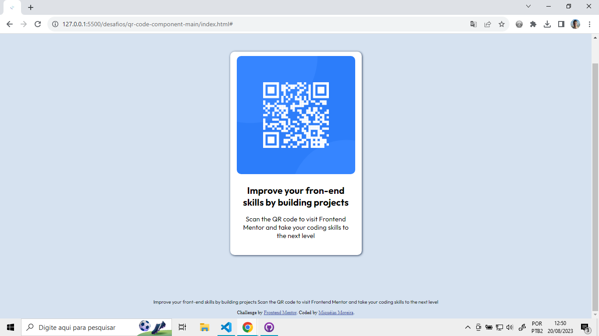

# Frontend Mentor - QR code component solution

This is a solution to the [QR code component challenge on Frontend Mentor](https://www.frontendmentor.io/challenges/qr-code-component-iux_sIO_H). Frontend Mentor challenges help you improve your coding skills by building realistic projects. 

## Table of contents

- [Overview](#overview)
  - [Screenshot](#screenshot)
- [My process](#my-process)
  - [Built with](#built-with)
  - [What I learned](#what-i-learned)
- [Author](#author)

## Overview

The project consisted of creating a page that had a large QR code in the center, but needed to leave the style of the site the same as what was proposed.

### Screenshot

## My process

### Built with

- Semantic HTML5 markup
- CSS custom properties

### What I learned

...

## Author

- LinkedIn - [Miquéias Moreira](https://www.linkedin.com/in/miqueias-moreira/)
- Frontend Mentor - [@yourusername](https://www.frontendmentor.io/profile/miqueiasmoreira)